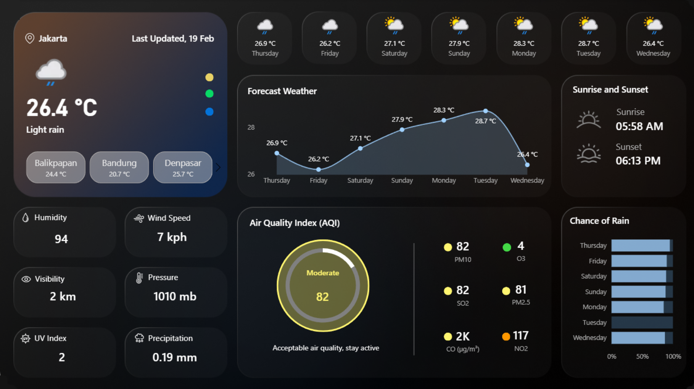
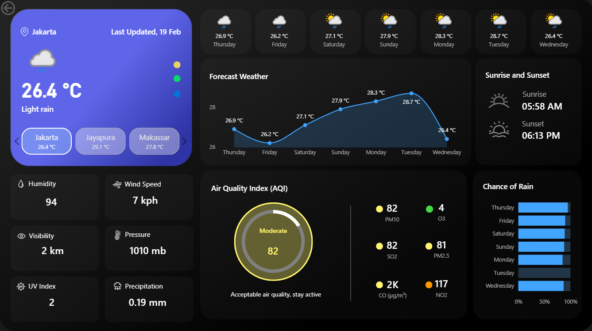
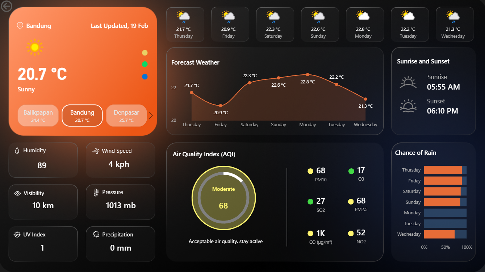

# 🌦️ Indonesia Weather Analytics Dashboard Project

## 📌 Project Overview
This project presents an interactive **Weather Analytics Dashboard** built using Power BI to monitor real-time weather conditions and air quality across major cities in Indonesia.

The dashboard provides a **high-level overview of current weather**, **7-day forecast trends**, and **air quality insights**, enabling users to quickly understand environmental conditions across regions.

🔗 **Cities Covered:** Sabang, Medan, Jakarta, Bandung, Semarang, Surabaya, Denpasar, Balikpapan, Makassar, Jayapura  

---

## 🧩 Business Problem
Weather and environmental data are often scattered across different sources and presented in raw formats, making it difficult to quickly interpret conditions or compare across locations.

This project transforms real-time weather data into an interactive dashboard that helps:

- Monitor current weather conditions across cities  
- Track forecast temperature trends  
- Analyse air quality levels  
- Compare environmental metrics between regions  
- Provide quick situational awareness  

---

## 📂 Dataset
- **Source:** WeatherAPI  
- **Type:** Real-time weather API data  
- **Coverage:** 10 major Indonesian cities  

### Data Includes:
- Temperature  
- Weather condition  
- Forecast data  
- Humidity  
- Wind speed  
- Pressure  
- Visibility  
- UV index  
- Precipitation  
- Air quality metrics (CO, NO2, SO2, PM2.5, PM10, O3)  

---

## 🛠️ Tools Used
- **Microsoft Power BI** – Data modelling & visualisation  
- **WeatherAPI** – Data source  
- **Power Query** – Data transformation  
- **Figma** – Dashboard background design  

---

# 🟦 Weather Dashboard | Features

## 🎯 Dashboard Purpose
The dashboard provides a comprehensive overview of weather conditions and environmental quality through interactive visuals and real-time metrics.

---

## 📌 Current Weather Section
- Display current temperature and weather condition  
- City selector to switch between locations  
- Last updated indicator  
- Quick comparison between selected cities  

---

## 📌 Weather Metrics
Displays key environmental indicators:

- Humidity  
- Wind Speed  
- Visibility  
- Pressure  
- UV Index  
- Precipitation  

---

## 📌 Forecast Weather
- 7-day temperature trend line chart  
- Daily forecast cards with temperature and condition  

---

## 📌 Air Quality Index (AQI)
- AQI gauge showing overall air quality level  

### Pollutant Breakdown:
- PM10  
- PM2.5  
- CO  
- NO2  
- SO2  
- O3  

---

## 📌 Chance of Rain
- Probability of rainfall by day  

---

# ⚙️ Design & Interactivity

## 🔄 Dashboard Dynamics
- Interactive city selector  
- Visual filtering through charts  
- Smooth navigation between elements  
- Clean dark theme UI for better readability  

## 🎛️ Filters
Users can dynamically explore weather metrics by selecting different cities and interacting with visual components.

---

## 💡 Potential Use Cases
- Environmental monitoring dashboards  
- Weather analytics reporting  
- Public information dashboards  
- Data visualisation portfolio projects  

---

## 🖼️ Dashboard Preview




---

## 📂 Repository Structure

```
weather-air-quality-dashboard/
├── dashboard/
│   ├── weather-dashboard.pbix
│   └── dashboard-preview
├── backgrounds/
├── icons
├── static-dataset/
│   ├── master-table.xlsx
│   └── current.xlsx
│   └── forecast-day.xlsx
│   └── forecast-hour.xlsx
│   └── location.xlsx
└── README.md
```

---

## 👋 About Me

Hi there! I'm Novia Noer Ramdiany. I’m passionate about data analytics and transforming complex datasets into clear, actionable insights.

Let’s connect:  
🔗 https://www.linkedin.com/in/noviaramdiany/

⭐ If you find this project interesting, feel free to explore and connect!


